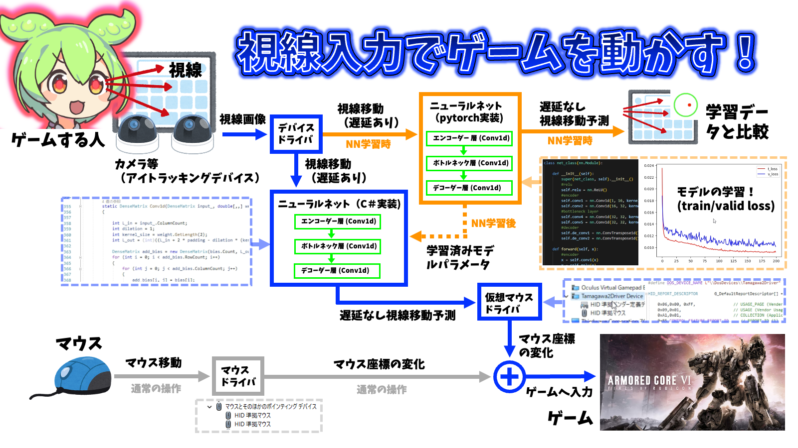

# 目の動きからどこを見ているかを予測するpythonプログラム

デモ動画　https://www.youtube.com/watch?v=Yf-E6yyvOr4&t=3s
## 使い方
1. まずC#で作ったEyetrackingAimプログラムを使ってデータを集めてください。ここにurl
2. requirements.txtを使って、必要なライブラリを環境にインストールしてください。
```bash
pip install -r requirements.txt
```
3. main.pyを実行します。するとgradioのサーバーが立ち上がるのでChromeなどで開いてください。

## 座標の位置のズレを調整する場合(CaliCoodinateタブ)
1. データを格納しているフォルダを指定してください。
2. データを出力するフォルダを指定してください。
3. batchsize, num_epochsを自分が取ったデータ量に合わせて変えてください。
4. DoCoodinateボタンを押して、機械学習をしてください。

## 座標の時間のズレを調整する場合(CaliOffsetタブ)
1. データを格納しているフォルダを指定してください。Track,Flick,Stopはそれぞれ別のフォルダにしてください
2. データを出力するフォルダを指定してください。
3. batchsize, num_epochsを自分が取ったデータ量に合わせて変えてください。
4. inputsizeは直近何個のデータを使って未来の座標を予測するかです。0.5秒分くらいのデータを入れるとうまく動きます。
4. DoOffsetボタンを押して、機械学習をしてください。


